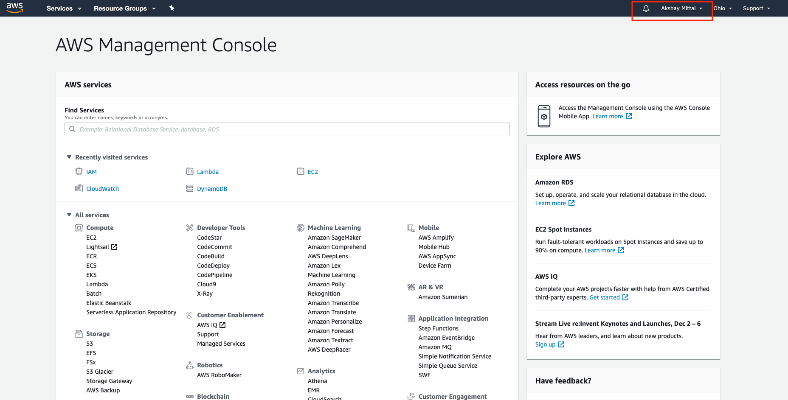
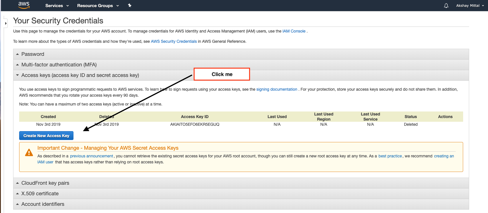
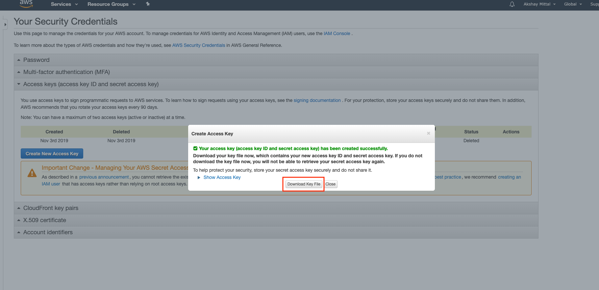

# How do I get AWS_ACCESS_KEY_ID and AWS_SECRET_ACCESS_KEY from Amazon

1. Goto [AWS Console](https://us-east-2.console.aws.amazon.com/console/home?region=us-east-2)

2. Click on your username near the top right and select My Security Credentials

3. Click `Create New Access Key`

4. Click `Download Key File` in the popup

 
- or you may click Show Access Key and copy `AWS_ACCESS_KEY_ID` & `AWS_SECRET_ACCESS_KEY` 

5. copy & paste values in [terraform.tfvars](../chap1/terraform.tfvars) (you might want to clone this repo for the workshop)

Great work!

your ready for the workshop. :)
